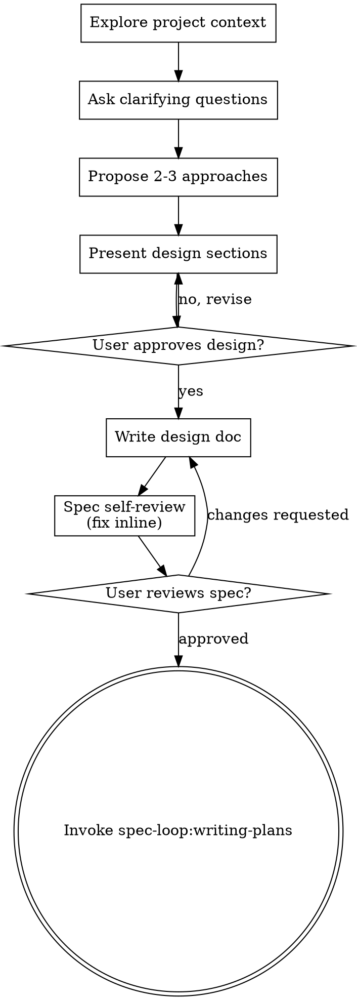

# Brainstorming — turn ideas into approved designs

## Overview

Turn a raw idea into a fully formed design and a committed spec through natural, collaborative dialogue — then hand off to planning. Start by understanding the current project context, ask questions **one at a time** to refine the idea, present the design in sections, get approval, write the spec, and only then transition to `spec-loop:writing-plans`.

This skill produces a **spec**, not code. It never writes implementation, scaffolds a project, or invokes any implementation skill. Its single terminal action is invoking `spec-loop:writing-plans`.

<HARD-GATE>
Do NOT invoke any implementation skill, write any code, scaffold any project, or take any implementation action until you have presented a design AND the user has approved it. This applies to EVERY project regardless of perceived simplicity.
</HARD-GATE>

Every project goes through this process — a todo list, a single-function utility, a config change. "Simple" projects are where unexamined assumptions cause the most wasted work. The design can be a few sentences for a truly simple project, but it must be presented and approved.

**Inside a spec-loop run:** this design-approval human gate is governed by `spec-loop:escalation-gate`, which **intentionally overrides** the interactive "one question at a time + require design approval" checkpoint. During an active run the controller runs the Iron Council at intake plus an escalation round in place of interactive approval — you do not stop to ask the user question-by-question or wait for a design sign-off. Outside a run (interactive use), the gate applies exactly as written below. The HARD-GATE on writing code before a design exists is never waived.

## Checklist

Create a task for each of these and complete them **in order**:

1. **Explore project context** — check files, docs, recent commits.
2. **Offer the visual companion just-in-time** — NOT upfront, and only if a question ever arises that is genuinely clearer shown than described. See "Visual companion" below.
3. **Ask clarifying questions** — one at a time; understand purpose, constraints, success criteria.
4. **Propose 2-3 approaches** — with trade-offs and your recommendation.
5. **Present design** — in sections scaled to their complexity (a few sentences if straightforward, up to 200-300 words if nuanced), covering architecture, components, data flow, error handling, testing; get user approval after each section.
6. **Write design doc** — save to `docs/spec-loop/specs/YYYY-MM-DD-<topic>-design.md` and commit.
7. **Spec self-review** — quick **inline** check for placeholders, contradictions, ambiguity, scope (see below). This is NOT a subagent dispatch.
8. **User reviews written spec** — ask the user to review the spec file before proceeding.
9. **Transition to implementation** — invoke `spec-loop:writing-plans`.

## Process flow

**The terminal state is invoking `spec-loop:writing-plans`.** Do NOT invoke `frontend-design`, any MCP-builder, or any other implementation skill.

## Scoping and design quality

- **Assess scope before the detailed questions.** If the request describes multiple independent subsystems ("a platform with chat, file storage, billing, and analytics"), flag it immediately rather than refining details of a project that needs decomposition first. Decompose into sub-projects — what are the independent pieces, how do they relate, what order should they be built — then brainstorm the first one through the normal flow. Each sub-project gets its own spec → plan → implementation cycle.
- **Design for isolation.** Break the system into units with one clear purpose, well-defined interfaces, and independent testability. For each unit you should be able to say what it does, how you use it, and what it depends on. If someone can't understand a unit without reading its internals, or you can't change the internals without breaking consumers, the boundaries need work. A file growing large is often a signal it's doing too much.
- **In existing codebases,** explore the current structure before proposing changes and follow existing patterns. Where existing code has problems that affect the work (a file grown too large, tangled responsibilities), include **targeted** improvements in the design — the way a good developer improves code they're working in. Don't propose unrelated refactoring.

## After the design

### Documentation

- Write the validated design (spec) to `docs/spec-loop/specs/YYYY-MM-DD-<topic>-design.md`. (User preferences for spec location override this default.)
- Use `elements-of-style:writing-clearly-and-concisely` if that skill is available.
- **Commit the design document to git.** (Inside a spec-loop run, honor the change-control rules: no broad `git add -A`/`git add .`, no committing on `main`, no pushing mid-run.)

### Spec self-review (inline — not a subagent)

After writing the spec document, look at it with fresh eyes and fix issues **inline yourself**: placeholders and vague requirements; sections that contradict each other, or an architecture that doesn't match the feature descriptions; scope that needs decomposition; requirements that could be read two ways (pick one and make it explicit). Fix and move on — no re-review needed.

### User review gate

After the spec review passes, ask the user to review the written spec before proceeding, using this exact prompt:

> "Spec written and committed to `<path>`. Please review it and let me know if you want to make any changes before we start writing out the implementation plan."

Wait for the user's response. If they request changes, make them and re-run the spec self-review. Only proceed once the user approves.

**Inside a spec-loop run:** this review gate is also governed by `spec-loop:escalation-gate` — the controller decides whether the spec is unambiguous enough to proceed-and-log or whether it must surface to the human, rather than pausing here interactively.

### Implementation

Invoke `spec-loop:writing-plans` to create a detailed implementation plan. Do NOT invoke any other skill.

## Key principles

- **One question at a time** — don't overwhelm with multiple questions.
- **Multiple choice preferred** — easier to answer than open-ended when possible.
- **YAGNI ruthlessly** — remove unnecessary features from every design.
- **Explore alternatives** — always propose 2-3 approaches before settling, leading with your recommendation and the reasoning for it.
- **Incremental validation** — present design, get approval before moving on.
- **Be flexible** — go back and clarify when something doesn't make sense.

## Visual companion (optional extra)

A browser-based companion for showing mockups, diagrams, and visual options during brainstorming. It is **an optional tool, not a mode, and not required** — the skill works fully in the terminal. Accepting it means it's *available* for questions that benefit from visual treatment, not that every question goes through the browser.

**Offering it (just-in-time):** wait until a question would genuinely be clearer shown than told — a real mockup / layout / diagram question, not merely a UI *topic*. The first time that happens, offer it as **its own message**, with no other content:

> "This next part might be easier if I show you — I can put together mockups, diagrams, and comparisons in a browser tab as we go. It's still new and can be token-intensive. Want me to? I'll open it for you."

Wait for the response. If they accept, start the server with `--open` so their browser opens to the first screen. If they decline, continue text-only and don't offer again unless they raise it.

**Per-question decision:** even after acceptance, decide for each question whether the user would understand it better by seeing it than reading it. Browser for content that IS visual — mockups, wireframes, layout comparisons, architecture diagrams. Terminal for text — requirements, conceptual choices, tradeoff lists, scope decisions. A question about a UI topic is not automatically a visual question.

If the user agrees to the companion, read the detailed guide before proceeding: `${CLAUDE_PLUGIN_ROOT}/skills/brainstorming/visual-companion.md`

Start/stop scripts live in `${CLAUDE_PLUGIN_ROOT}/skills/brainstorming/scripts/` (`start-server.sh`, `stop-server.sh`). They are zero-dependency Node/bash — no install step.

## When NOT to use this

- **You already have an approved design or spec** and need an implementation plan → use `spec-loop:writing-plans`.
- **You have a plan and are ready to build** → use `spec-loop:subagent-driven-development` or `spec-loop:executing-plans`.
- **Pure visual/aesthetic direction for existing UI** with requirements already settled → use `frontend-design`. (Brainstorming still owns *what* to build and its design.)
- **A bug, test failure, or unexpected behavior** → use `spec-loop:systematic-debugging`. Brainstorming is for *new* intent, not diagnosing broken behavior.
