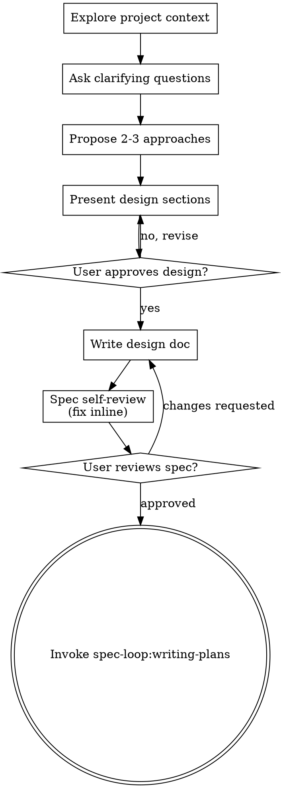

# Brainstorming — turn ideas into approved designs

## Overview

Turn a raw idea into a fully formed design and a committed spec through natural, collaborative dialogue — then hand off to planning. Start by understanding the current project context, ask questions **one at a time** to refine the idea, present the design in sections, get approval, write the spec, and only then transition to `spec-loop:writing-plans`.

This skill produces a **spec**, not code. It never writes implementation, scaffolds a project, or invokes any implementation skill. Its single terminal action is invoking `spec-loop:writing-plans`.

<HARD-GATE>
Do NOT invoke any implementation skill, write any code, scaffold any project, or take any implementation action until you have presented a design AND the user has approved it. This applies to EVERY project regardless of perceived simplicity.
</HARD-GATE>

**Inside a spec-loop run:** this design-approval human gate is governed by `spec-loop:escalation-gate`, which **intentionally overrides** the interactive "one question at a time + require design approval" checkpoint. During an active run the controller runs the Iron Council at intake plus an escalation round in place of interactive approval — you do not stop to ask the user question-by-question or wait for a design sign-off. Outside a run (interactive use), the gate applies exactly as written below. The HARD-GATE on writing code before a design exists is never waived.

## Anti-pattern: "this is too simple to need a design"

Every project goes through this process. A todo list, a single-function utility, a config change — all of them. "Simple" projects are where unexamined assumptions cause the most wasted work. The design can be short (a few sentences for truly simple projects), but you MUST present it and get approval.

## Checklist

Create a task for each of these and complete them **in order**:

1. **Explore project context** — check files, docs, recent commits.
2. **Offer the visual companion just-in-time** — NOT upfront. The first time a question would genuinely be clearer shown than described, offer it then (its own message); on approval its browser tab opens for you. If no visual question ever arises, never offer it. See "Visual companion" below. This is an OPTIONAL extra — the skill works fully without it.
3. **Ask clarifying questions** — one at a time; understand purpose, constraints, success criteria.
4. **Propose 2-3 approaches** — with trade-offs and your recommendation.
5. **Present design** — in sections scaled to their complexity; get user approval after each section.
6. **Write design doc** — save to `docs/spec-loop/specs/YYYY-MM-DD-<topic>-design.md` and commit.
7. **Spec self-review** — quick **inline** check for placeholders, contradictions, ambiguity, scope (see below). This is NOT a subagent dispatch — you do it yourself.
8. **User reviews written spec** — ask the user to review the spec file before proceeding.
9. **Transition to implementation** — invoke `spec-loop:writing-plans` to create the implementation plan.

## Process flow

**The terminal state is invoking `spec-loop:writing-plans`.** Do NOT invoke `frontend-design`, any MCP-builder, or any other implementation skill. The ONLY skill you invoke after brainstorming is `spec-loop:writing-plans`.

## The process

### Understanding the idea

- Check the current project state first (files, docs, recent commits).
- Before asking detailed questions, **assess scope**: if the request describes multiple independent subsystems (e.g., "build a platform with chat, file storage, billing, and analytics"), flag this immediately. Don't spend questions refining details of a project that needs to be decomposed first.
- **If the project is too large for a single spec, decompose into sub-projects:** what are the independent pieces, how do they relate, what order should they be built? Then brainstorm the first sub-project through the normal design flow. Each sub-project gets its own spec → plan → implementation cycle.
- For appropriately-scoped projects, ask questions **one at a time** to refine the idea.
- **Prefer multiple-choice questions** when possible; open-ended is fine too.
- **Only one question per message** — if a topic needs more exploration, break it into multiple questions.
- Focus on understanding: purpose, constraints, success criteria.

### Exploring approaches

- Propose **2-3 different approaches** with trade-offs.
- Present options conversationally, **leading with your recommendation** and the reasoning for it.

### Presenting the design

- Once you believe you understand what you're building, present the design.
- **Scale each section to its complexity:** a few sentences if straightforward, up to 200-300 words if nuanced.
- **Ask after each section** whether it looks right so far.
- Cover: architecture, components, data flow, error handling, testing.
- Be ready to go back and clarify if something doesn't make sense.

### Design for isolation and clarity

- Break the system into smaller units that each have one clear purpose, communicate through well-defined interfaces, and can be understood and tested independently.
- For each unit, you should be able to answer: what does it do, how do you use it, what does it depend on?
- Can someone understand what a unit does without reading its internals? Can you change the internals without breaking consumers? If not, the boundaries need work.
- Smaller, well-bounded units are also easier to work with — you reason better about code you can hold in context at once, and edits are more reliable when files are focused. A file growing large is often a signal it's doing too much.

### Working in existing codebases

- Explore the current structure before proposing changes. Follow existing patterns.
- Where existing code has problems that affect the work (a file grown too large, unclear boundaries, tangled responsibilities), include **targeted** improvements as part of the design — the way a good developer improves code they're working in.
- Don't propose unrelated refactoring. Stay focused on what serves the current goal.

## After the design

### Documentation

- Write the validated design (spec) to `docs/spec-loop/specs/YYYY-MM-DD-<topic>-design.md`.
  - (User preferences for spec location override this default.)
- Use `elements-of-style:writing-clearly-and-concisely` if that skill is available.
- **Commit the design document to git.** (Inside a spec-loop run, honor the change-control rules: no broad `git add -A`/`git add .`, no committing on `main`, no pushing mid-run.)

### Spec self-review (inline — not a subagent)

After writing the spec document, look at it with fresh eyes and fix issues **inline yourself**:

1. **Placeholder scan** — any "TBD", "TODO", incomplete sections, or vague requirements? Fix them.
2. **Internal consistency** — do any sections contradict each other? Does the architecture match the feature descriptions?
3. **Scope check** — is this focused enough for a single implementation plan, or does it need decomposition?
4. **Ambiguity check** — could any requirement be interpreted two different ways? If so, pick one and make it explicit.

Fix any issues inline. No need to re-review — just fix and move on.

### User review gate

After the spec review passes, ask the user to review the written spec before proceeding, using this exact prompt:

> "Spec written and committed to `<path>`. Please review it and let me know if you want to make any changes before we start writing out the implementation plan."

Wait for the user's response. If they request changes, make them and re-run the spec self-review. Only proceed once the user approves.

**Inside a spec-loop run:** this review gate is also governed by `spec-loop:escalation-gate` — the controller decides whether the spec is unambiguous enough to proceed-and-log or whether it must surface to the human, rather than pausing here interactively.

### Implementation

- Invoke `spec-loop:writing-plans` to create a detailed implementation plan.
- Do NOT invoke any other skill. `spec-loop:writing-plans` is the next step.

## Key principles

- **One question at a time** — don't overwhelm with multiple questions.
- **Multiple choice preferred** — easier to answer than open-ended when possible.
- **YAGNI ruthlessly** — remove unnecessary features from every design.
- **Explore alternatives** — always propose 2-3 approaches before settling.
- **Incremental validation** — present design, get approval before moving on.
- **Be flexible** — go back and clarify when something doesn't make sense.

## Visual companion (optional extra)

A browser-based companion for showing mockups, diagrams, and visual options during brainstorming. It is **an optional tool, not a mode, and not required** — the skill works fully in the terminal. Accepting the companion means it's *available* for questions that benefit from visual treatment; it does NOT mean every question goes through the browser.

**Offering the companion (just-in-time):** Do NOT offer it upfront. Wait until a question would genuinely be clearer shown than told — a real mockup / layout / diagram question, not merely a UI *topic*. The first time that happens, offer it then, as its own message:

> "This next part might be easier if I show you — I can put together mockups, diagrams, and comparisons in a browser tab as we go. It's still new and can be token-intensive. Want me to? I'll open it for you."

**This offer MUST be its own message.** Only the offer — no clarifying question, summary, or other content. Wait for the user's response. If they accept, start the server with `--open` so their browser opens to the first screen automatically. If they decline, continue text-only and don't offer again unless they raise it.

**Per-question decision:** Even after the user accepts, decide FOR EACH QUESTION whether to use the browser or the terminal. The test: **would the user understand this better by seeing it than reading it?**

- **Use the browser** for content that IS visual — mockups, wireframes, layout comparisons, architecture diagrams, side-by-side visual designs.
- **Use the terminal** for content that is text — requirements questions, conceptual choices, tradeoff lists, A/B/C/D text options, scope decisions.

A question about a UI topic is not automatically a visual question. "What does personality mean in this context?" is conceptual — use the terminal. "Which wizard layout works better?" is visual — use the browser.

If the user agrees to the companion, read the detailed guide before proceeding:
`${CLAUDE_PLUGIN_ROOT}/skills/brainstorming/visual-companion.md`

Start/stop scripts live in `${CLAUDE_PLUGIN_ROOT}/skills/brainstorming/scripts/` (`start-server.sh`, `stop-server.sh`). They are zero-dependency Node/bash — no install step.

## When NOT to use this

- **You already have an approved design or spec** and need an implementation plan → use `spec-loop:writing-plans`.
- **You have a plan and are ready to build** → use `spec-loop:subagent-driven-development` or `spec-loop:executing-plans`.
- **Pure visual/aesthetic direction for existing UI** with requirements already settled → use `frontend-design`. (Brainstorming still owns *what* to build and its design; `frontend-design` is a downstream implementation concern you reach only after `spec-loop:writing-plans`.)
- **A bug, test failure, or unexpected behavior** → use `spec-loop:systematic-debugging`. Brainstorming is for *new* intent, not diagnosing broken behavior.

## Red flags — stop and correct

- You started writing code, scaffolding, or invoking an implementation skill before a design was presented and approved. **Stop — the HARD-GATE was violated.**
- You asked more than one question in a single message.
- You presented a design without offering 2-3 approaches first.
- You skipped writing/committing the spec and jumped toward planning.
- You invoked something other than `spec-loop:writing-plans` as the next step.
- You offered the visual companion upfront, or bundled the offer with other content instead of sending it as its own message.
- You treated the visual companion as required, or ran every question through the browser after the user accepted it.

## Provenance and maintenance

Ported from `superpowers` v6.1.1 (github.com/obra/superpowers, MIT) `skills/brainstorming` on 2026-07-08; adapted for spec-loop. Namespace/paths remapped (`superpowers:*` → `spec-loop:*`, `docs/superpowers/specs/` → `docs/spec-loop/specs/`, `.superpowers/brainstorm/` → `.spec-loop/brainstorm/`), branding neutralized, and the escalation-gate override notes added. The vestigial `spec-document-reviewer-prompt.md` was **not** ported — the source SKILL body performs the spec self-review inline and never dispatches that prompt as a subagent, so it carried no behavior. Cross-harness launch notes (Codex, Copilot CLI) in the visual-companion guide were cut.

Re-verify if things drift:
- Sibling skills still exist: `ls plugins/spec-loop/skills/writing-plans plugins/spec-loop/skills/subagent-driven-development plugins/spec-loop/skills/executing-plans plugins/spec-loop/skills/systematic-debugging plugins/spec-loop/skills/escalation-gate`
- Companion scripts resolve: `ls "${CLAUDE_PLUGIN_ROOT}/skills/brainstorming/scripts/"{start-server.sh,stop-server.sh,server.cjs,helper.js,frame-template.html}`
- Scripts still parse: `node --check plugins/spec-loop/skills/brainstorming/scripts/server.cjs && bash -n plugins/spec-loop/skills/brainstorming/scripts/start-server.sh`
- Escalation-gate override wording is still consistent: `sed -n '12,17p' plugins/spec-loop/skills/escalation-gate/SKILL.md`
