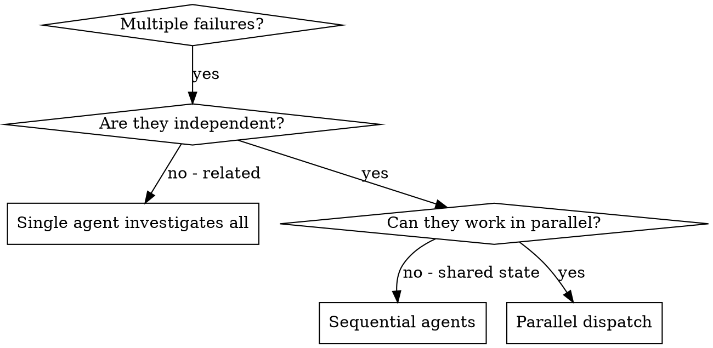

# Dispatching Parallel Agents — one isolated agent per independent domain

## Overview

You delegate a task to an agent with **isolated context**: it never inherits your session history. You hand it exactly the context it needs, so it stays focused and you keep your own context free for coordination. When several unrelated problems each stand alone (different test files, different subsystems, different bugs), investigating them one after another wastes time — each investigation is independent and can run at the same time.

**Core principle:** dispatch one agent per independent problem domain, and let them work concurrently.

Isolated context is the point and the constraint. The agent cannot see what you have already discovered, so a prompt that assumes shared knowledge fails. Everything the agent needs to succeed goes into its prompt.

## When to use



**Use when:**
- 3+ test files failing with different root causes.
- Multiple subsystems broken independently.
- Each problem can be understood without context from the others.
- No shared state between investigations.

**Don't use when:**
- Failures are related (fixing one might fix the others) — investigate together first.
- You need to understand the full system state to make sense of any one problem.
- Agents would interfere with each other (editing the same files, using the same resources).
- The work is exploratory and you don't yet know what is broken.

## The pattern

### 1. Identify independent domains

Group the failures by what is broken. Each group must be understandable and fixable on its own:
- File A tests: tool approval flow.
- File B tests: batch completion behavior.
- File C tests: abort functionality.

Fixing tool approval does not touch the abort tests — that independence is what makes them parallelizable.

### 2. Write focused, self-contained task prompts

Each agent's prompt carries everything it needs, because it sees none of your context. Include:
- **Scope** — one test file or subsystem, named explicitly.
- **Goal** — the observable outcome (e.g. "make these tests pass").
- **Constraints** — what it must not touch (e.g. "do NOT change production code").
- **Expected output** — what the agent should return to you (root cause + what changed).

### 3. Dispatch — one response for parallel, one-per-response for sequential

Issue all the dispatches **in a single response**. Multiple dispatch calls in one response run concurrently; one dispatch per response runs sequentially.

```text
Agent (general-purpose): "Fix agent-tool-abort.test.ts failures"
Agent (general-purpose): "Fix batch-completion-behavior.test.ts failures"
Agent (general-purpose): "Fix tool-approval-race-conditions.test.ts failures"
# All three dispatched in one response → they run concurrently.
```

**Nesting rule (spec-loop) — canonical statement; other skills point here:** only a top-level session may dispatch background (concurrent) agents. **From inside any agent — including a spec-loop slice worker (`spec-loop:spec-loop-slice`) — every dispatch MUST be synchronous: `run_in_background: false`.** The platform forbids in-process teammates from spawning background agents ("In-process teammates cannot spawn background agents"). So if you are already running as an agent, you cannot fan out concurrently; dispatch one synchronous agent at a time. This skill's parallel-dispatch payoff is available only at the top level.

### 4. Review and integrate

When the agents return:
- Read each summary.
- Check for conflicts — did two agents edit the same code?
- Run the full test suite (not just the individual files).
- Integrate all changes, then spot-check — agents can make systematic errors.

## Agent prompt structure

A good prompt is **focused** (one problem domain), **self-contained** (all context needed, since the agent sees none of yours), and **specific about output** (what it must return).

```markdown
Fix the 3 failing tests in src/agents/agent-tool-abort.test.ts:

1. "should abort tool with partial output capture" - expects 'interrupted at' in message
2. "should handle mixed completed and aborted tools" - fast tool aborted instead of completed
3. "should properly track pendingToolCount" - expects 3 results but gets 0

These are timing/race condition issues. Your task:

1. Read the test file and understand what each test verifies
2. Identify root cause - timing issues or actual bugs?
3. Fix by:
   - Replacing arbitrary timeouts with event-based waiting
   - Fixing bugs in abort implementation if found
   - Adjusting test expectations if testing changed behavior

Do NOT just increase timeouts - find the real issue.

Return: Summary of what you found and what you fixed.
```

## Common mistakes

| Mistake | ❌ Bad | ✅ Good |
|---|---|---|
| Too broad | "Fix all the tests" — the agent gets lost | "Fix agent-tool-abort.test.ts" — focused scope |
| No context | "Fix the race condition" — the agent doesn't know where | Paste the error messages and test names into the prompt |
| No constraints | Agent refactors everything | "Do NOT change production code" / "Fix tests only" |
| Vague output | "Fix it" — you don't learn what changed | "Return a summary of root cause and changes" |

## Verification

After the agents return:
1. **Review each summary** — understand what changed.
2. **Check for conflicts** — did agents edit the same code?
3. **Run the full suite** — verify all fixes work together, not just in isolation.
4. **Spot-check** — agents can make systematic errors an isolated summary won't reveal.

## When NOT to use this

This skill is for **ad-hoc fan-out over independent, stateless problems**. It is not the mechanism for either of spec-loop's structured execution paths:

- **Sequential plan execution → use `spec-loop:subagent-driven-development`.** When you are working a written plan of tasks, its implementers run **deliberately sequentially — one implementer at a time, never in parallel** — because later tasks build on the committed state of earlier ones. Fanning those out concurrently would corrupt that shared, evolving state. Do not use this skill to parallelize plan tasks.
- **Cross-slice parallelism → owned by the `/spec-loop` controller's wave scheduler.** A spec-loop run already parallelizes independent *slices* through its DAG/wave scheduler, and each slice runs as a background `spec-loop:spec-loop-slice` worker. That is the controller's job, not this skill's. And because a slice worker is itself an agent, it cannot fan out further concurrently (see the nesting rule above) — inside a slice, all dispatch is synchronous.
- **Related, shared-context, or exploratory work → keep it in one agent** (or your own session). See "Don't use when" above.

If you are unsure whether two problems are truly independent, treat them as related and investigate together first — a false-parallel dispatch produces conflicting edits that cost more than the time it saved.

## Provenance and maintenance

Ported from `superpowers` v6.1.1 (github.com/obra/superpowers, MIT) `skills/dispatching-parallel-agents` on 2026-07-08; adapted for spec-loop. Adaptations: added the **nesting rule** (top-level-only background dispatch; synchronous from inside any agent), added the spec-loop boundary in "When NOT to use this" (sequential plans → `subagent-driven-development`; cross-slice parallelism → the `/spec-loop` wave scheduler), and folded the Common Mistakes list into a table. Cut the source's "Real Example from Session" / "Real-World Impact" / "Key Benefits" narrative sections for token discipline.

Re-verify if things drift:
- Sibling skill names exist: `ls plugins/spec-loop/skills/subagent-driven-development plugins/spec-loop/skills/escalation-gate`.
- Slice worker's synchronous-dispatch rule still holds: `grep -n "run_in_background: false" plugins/spec-loop/agents/spec-loop-slice.md`.
- SDD's sequential-implementer discipline still holds: `grep -ni "sequential\|one implementer\|never parallel" plugins/spec-loop/skills/subagent-driven-development/SKILL.md`.
