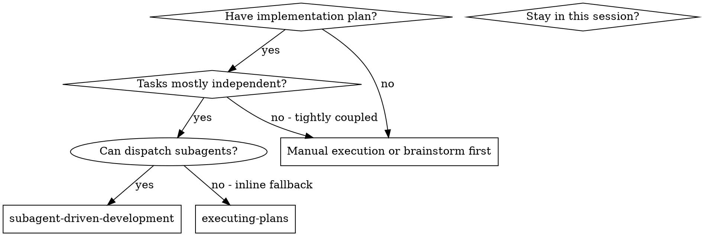
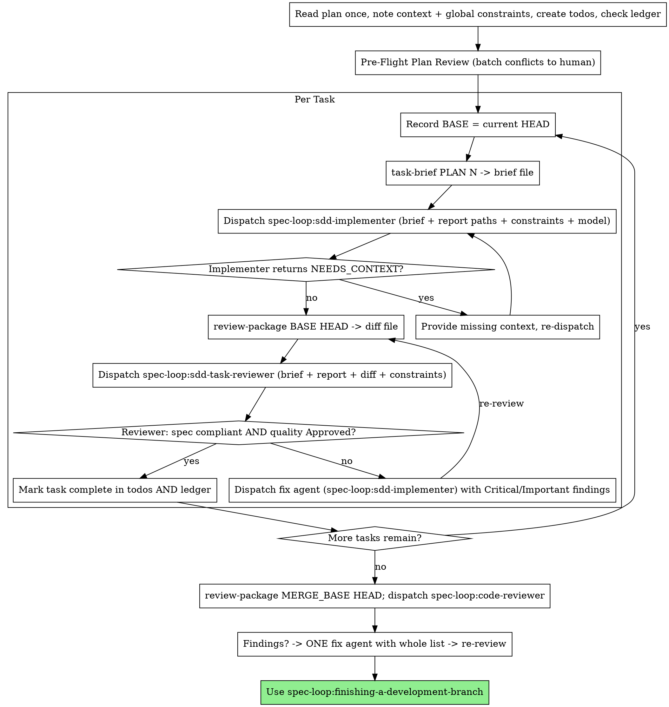

# Subagent-Driven Development — one fresh agent per task, reviewed, then a whole-branch pass

## Overview

Execute a plan by dispatching a fresh **implementer** agent per task, a **task reviewer** (spec compliance + code quality) after each, and one broad **whole-branch reviewer** at the end. You are the orchestrator: you never write the code yourself, you construct exactly the context each agent needs, and you move artifacts as files so they never pollute your context.

**Why subagents:** you delegate each task to an agent with isolated context. By crafting its instructions precisely, you keep it focused and preserve your own context for coordination. Agents never inherit your session history — you build exactly what they need.

**Core principle:** fresh implementer per task + task review (spec AND quality) + broad final review = high quality, fast iteration.

**Narration:** between tool calls, narrate at most one short line — the ledger and tool results carry the record.

**Continuous execution:** do NOT pause to check in between tasks. Execute every task in the plan without stopping. The only reasons to stop are: a `BLOCKED` you cannot resolve, ambiguity that genuinely prevents progress, or all tasks complete. "Should I continue?" prompts and progress summaries waste the human's time — they asked you to execute the plan, so execute it. (Inside a spec-loop run, stopping is never a direct prompt — see [Inside a spec-loop run](#inside-a-spec-loop-run).)

This skill dispatches the plugin's named agent types, not raw `general-purpose` agents with pasted prompt templates:

| Role | Agent type | Runs |
|---|---|---|
| Implementer (per task) | `spec-loop:sdd-implementer` | one per task, sequentially |
| Task reviewer (per task) | `spec-loop:sdd-task-reviewer` | after each implementer, spec + quality |
| Fix agent (per finding batch) | `spec-loop:sdd-implementer` | same contract as implementer |
| Whole-branch reviewer (once) | `spec-loop:code-reviewer` | after all tasks pass |

## When to Use



## When NOT to use this

- **No plan yet** → use `spec-loop:brainstorming` then `spec-loop:writing-plans` first. This skill consumes a plan; it does not create one.
- **Tightly coupled tasks** (each depends on the last, cannot be reviewed in isolation) → execute manually or restructure the plan.
- **You cannot dispatch subagents** (e.g. you are already running inside an agent, which cannot background further agents) → use `spec-loop:executing-plans` instead. That skill executes the plan inline and sequentially in the current session; this one dispatches a fresh implementer subagent per task. Use this skill whenever subagent dispatch is available — it produces higher-quality work — and fall back to `executing-plans` only when it is not.

## The Process



**Before starting**, ensure an isolated workspace exists — drive `spec-loop:using-git-worktrees` (a spec-loop slice worker is already in one). Implementers follow `spec-loop:test-driven-development`.

## Pre-Flight Plan Review

Before dispatching Task 1, scan the plan once for conflicts:

- tasks that contradict each other or the plan's Global Constraints;
- anything the plan explicitly mandates that the review rubric treats as a defect (a test that asserts nothing, verbatim duplication of a logic block).

Present everything you find as ONE batched question — each finding beside the plan text that mandates it, asking which governs — before execution begins, not one interrupt per discovery mid-plan. If the scan is clean, proceed without comment. The review loop remains the net for conflicts that only emerge from implementation.

**Inside a spec-loop run:** this up-front human gate is governed by `spec-loop:escalation-gate` — batch the conflicts into an escalation entry and return `NEEDS_DECISION` rather than prompting directly. Outside a run (interactive use), ask the human as written.

## Model Selection

Use the **least powerful** model that can handle each role, to conserve cost and increase speed. **Always specify the model explicitly** — pass a `model` override on every dispatch. An omitted model inherits your session's model, often the most capable and most expensive, which silently defeats this section.

| Role / signal | Model tier | Example `model` |
|---|---|---|
| Mechanical implementation (1-2 files, complete spec; plan text contains the code to write) | cheapest | `haiku` |
| Single-file mechanical fix | cheapest | `haiku` |
| Integration / judgment (multi-file, pattern matching, debugging, prose-only spec) | standard | `sonnet` |
| Architecture / broad-codebase design | most capable | `opus` (or the most capable available) |
| **Final whole-branch review** | most capable | `opus` (or the most capable available) |
| Task reviewer | standard model scaled to the diff's size, complexity, and risk | `sonnet`; lift to `opus` for subtle concurrency/security diffs |

**Turn count beats token price.** Wall-clock and context cost scale with how many turns an agent takes, and the cheapest models routinely take 2-3× the turns on multi-step work — costing more overall. Use a mid-tier model as the **floor** for reviewers and for implementers working from prose descriptions. Reserve the cheapest tier for transcription-plus-testing (the task's plan text contains the complete code) and single-file mechanical fixes.

## Handling Implementer Status

`spec-loop:sdd-implementer` returns one of four statuses (the agent's own return
contract in `agents/sdd-implementer.md` is the canonical definition of each; this
section covers the orchestrator-side handling). Handle each:

- **DONE:** generate the review package (below) and dispatch the task reviewer.
- **DONE_WITH_CONCERNS:** the implementer completed the work but flagged doubts. Read the concerns before proceeding. If they are about correctness or scope, address them before review. If they are observations (e.g. "this file is getting large"), note them in the ledger and proceed to review.
- **NEEDS_CONTEXT:** the implementer needs information that was not provided. Provide it and re-dispatch (same model unless the gap was reasoning, not information).
- **BLOCKED:** the implementer cannot complete the task. Assess the blocker:
  1. context problem → provide more context, re-dispatch same model;
  2. needs more reasoning → re-dispatch with a more capable model;
  3. task too large → break it into smaller pieces;
  4. the plan itself is wrong → escalate to the human (inside a run: `spec-loop:escalation-gate` → `NEEDS_DECISION`).

**Never** ignore an escalation or force the same model to retry without changes. If the implementer said it is stuck, something needs to change.

## Handling Reviewer ⚠️ Items

The task reviewer may report "⚠️ Cannot verify from diff" items — requirements that live in unchanged code or span tasks. These do not block the rest of the review, but **you must resolve each one yourself before marking the task complete**: you hold the plan and cross-task context the reviewer lacks. If you confirm an item is a real gap, treat it as a failed spec review — send it back to the implementer and re-review.

## Constructing Dispatch Prompts

Per-task reviews are task-scoped gates. The broad review happens once, at the final whole-branch review. When you compose a dispatch:

- **No open-ended directives.** Do not add "check all uses" or "run race tests if useful" without a concrete, task-specific reason.
- **Do not re-run the implementer's tests.** Do not ask a reviewer to re-run tests the implementer already ran on the same code — the implementer's report carries the test evidence.
- **NEVER pre-judge findings.** Never instruct a reviewer to ignore or not flag a specific issue. If you believe a finding would be a false positive, let the reviewer raise it and adjudicate it in the review loop. If the prompt you are writing contains "do not flag," "don't treat X as a defect," "at most Minor," or "the plan chose" — stop: you are pre-judging, usually to spare yourself a review loop.
- **Global constraints, verbatim.** The global-constraints block you hand the reviewer is its attention lens. Copy the binding requirements verbatim from the plan's Global Constraints section or the spec: exact values, exact formats, and the stated relationships between components ("same layout as X", "matches Y"). The agent's own definition already carries the process rules (YAGNI, test hygiene, review method) — the constraints block is for what THIS project's spec demands.
- **Hand diffs as files.** Run `review-package BASE HEAD` (below) and pass the reviewer the file path it prints. The output never enters your own context, and the reviewer sees the commit list, stat summary, and full diff with context in one Read call.
- **One task per dispatch, never session history.** A dispatch prompt describes one task, not the session's history. Do not paste accumulated prior-task summaries ("state after Tasks 1-3") into later dispatches — a real session's dispatch hit 42k chars of which 99% was pasted history. A fresh agent needs its task, the interfaces it touches, and the global constraints. Nothing else.
- **Fix dispatches carry the implementer contract.** Dispatch fix agents (`spec-loop:sdd-implementer`) for Critical and Important findings. The fix agent re-runs the tests covering its change and reports the results — name the covering test files in the dispatch; a one-line fix does not need the whole suite. Before re-dispatching the reviewer, confirm the fix report contains the covering tests, the command run, and the output; dispatch the re-review once all three are present.
- **Record Minor findings** in the progress ledger as you go, and point the final whole-branch review at that list so it can triage which must be fixed before merge. A roll-up nobody reads is a silent discard.
- **Plan-mandated findings are the human's call.** A finding labeled plan-mandated — or any finding that conflicts with what the plan's text requires — is the human's decision, like any plan contradiction: present the finding and the plan text, ask which governs. Do not dismiss the finding because the plan mandates it, and do not dispatch a fix that contradicts the plan without asking. (Inside a run: route via `spec-loop:escalation-gate`.)
- **One final-review fix agent.** If the final whole-branch review returns findings, dispatch ONE fix agent with the complete findings list — not one fixer per finding. Per-finding fixers each rebuild context and re-run suites; a real session's final-review fix wave cost more than all its tasks combined.

### Recording BASE and generating the review package

```bash
# BEFORE dispatching the implementer for task N, record the base:
BASE=$(git rev-parse HEAD)

# AFTER the implementer returns DONE, generate the package. BASE is the commit
# you recorded above — NEVER HEAD~1, which silently drops all but the last
# commit of a multi-commit task. The script prints the unique path it wrote.
"${CLAUDE_PLUGIN_ROOT}/skills/subagent-driven-development/scripts/review-package" "$BASE" HEAD
```

## Dispatch Contracts

Dispatch the plugin's named agents via the Task tool. Fill each agent's input contract exactly — these are the fields the agent expects in its dispatch prompt.

**spec-loop:sdd-implementer** (implementer and fix agent) — supply:
```
description: "Implement Task N: <name>"   (fix: "Fix Task N review findings")
model: <chosen tier — REQUIRED, see Model Selection>
prompt:
  - Task brief FILE PATH ("read this first — it is your requirements, with the
    exact values to use verbatim"): <…/task-N-brief.md>
  - Report file PATH to write: <…/task-N-report.md>
  - One line on where this task fits in the project
  - Interfaces / decisions from earlier tasks the brief cannot know
  - Your resolution of any ambiguity you noticed in the brief
  - Global constraints, verbatim from the plan/spec
  - The model choice rationale (why this tier)
  - Instruction: if you have questions, return NEEDS_CONTEXT — do not guess
  - (fix dispatch only) the findings to fix + the covering test files to re-run
```

**spec-loop:sdd-task-reviewer** — supply:
```
description: "Review Task N (spec + quality)"
model: <standard, scaled to diff — REQUIRED>
prompt:
  - Task brief FILE PATH (same file the implementer worked from)
  - Global constraints, verbatim from the plan/spec (its attention lens)
  - Implementer report FILE PATH: <…/task-N-report.md>
  - Review-package diff FILE PATH: <the path review-package printed>
  - BASE_SHA and HEAD_SHA of the range
Returns: pinned verdict ending "Task quality: Approved | Needs fixes",
  a Spec Compliance verdict (✅ / ❌ / ⚠️), Strengths, and Issues
  (Critical / Important / Minor with file:line).
```

**spec-loop:code-reviewer** (final whole-branch review, once) — supply:
```
description: "Whole-branch review"
model: <most capable available — REQUIRED>
prompt:
  - DESCRIPTION: one line on what the branch delivers
  - PLAN_OR_REQUIREMENTS: the plan path (or requirements text)
  - BASE_SHA: MERGE_BASE (e.g. `git merge-base <integration-branch> HEAD`)
  - HEAD_SHA: current HEAD
  - Diff-package FILE PATH: run
    review-package MERGE_BASE HEAD and pass the printed path
  - The rolled-up Minor findings from the ledger, for triage
Returns: assessment ending "Ready to merge? Yes | No | With fixes".
```

## File Handoffs

Everything you paste into a dispatch prompt — and everything an agent prints back — stays resident in your context for the rest of the session and is re-read on every later turn. **Pasted text stays resident = the anti-pattern.** Hand artifacts over as files:

- **Task brief:** before dispatching an implementer, run
  `"${CLAUDE_PLUGIN_ROOT}/skills/subagent-driven-development/scripts/task-brief" PLAN_FILE N` — it extracts the task's full text to a uniquely named file and prints the path. The brief is the single source of requirements. Exact values (numbers, magic strings, signatures, test cases) appear **only** in the brief, never pasted into the dispatch.
- **Report file:** name the implementer's report file after the brief (`…/task-N-brief.md` → `…/task-N-report.md`) and put its path in the dispatch. The implementer writes the full report there and returns only status, commits, a one-line test summary, and concerns.
- **Reviewer inputs:** the task reviewer gets file paths — the same brief file, the report file, and the review package — plus the global constraints that bind the task.
- **Fix handoffs:** fix dispatches append their fix report (with test results) to the same report file and return a short summary; re-reviews read the updated file.

## Durable Progress

Conversation memory does not survive compaction. In real sessions, controllers that lost their place have **re-dispatched entire completed task sequences — the single most expensive failure observed.** Track progress in a ledger file, not only in todos.

- **At skill start, check for a ledger:**
  ```bash
  cat "$(git rev-parse --show-toplevel)/.spec-loop/sdd/progress.md" 2>/dev/null
  ```
  Tasks listed there as complete are DONE — **do not re-dispatch them**; resume at the first task not marked complete.
- **When a task's review comes back clean,** append one line to the ledger in the same message as your other bookkeeping (exact format):
  ```
  Task N: complete (commits <base7>..<head7>, review clean)
  ```
- **The ledger is your recovery map:** the commits it names exist in git even when your context no longer remembers creating them. **After compaction, trust the ledger and `git log` over your own recollection.** Re-dispatching a completed task sequence is the most expensive observed failure — never do it.
- `git clean -fdx` will destroy the ledger (it is git-ignored scratch); if that happens, recover from `git log`.

## Example Workflow

```
[Ensure worktree exists via spec-loop:using-git-worktrees]
[Check ledger: cat .../.spec-loop/sdd/progress.md — empty, fresh start]
[Read plan once: docs/spec-loop/plans/feature-plan.md; create todos; Pre-Flight scan clean]

Task 1: Hook installation script
  BASE=$(git rev-parse HEAD)
  task-brief docs/spec-loop/plans/feature-plan.md 1   -> .../task-1-brief.md
  Dispatch spec-loop:sdd-implementer (model: haiku — plan has the code):
    brief path, report path .../task-1-report.md, constraints verbatim, "questions -> NEEDS_CONTEXT"
  Implementer -> DONE: 2 commits, "5/5 passing, output pristine"
  review-package "$BASE" HEAD   -> .../review-<b>..<h>.diff
  Dispatch spec-loop:sdd-task-reviewer (model: sonnet): brief, constraints, report, diff paths
  Reviewer -> Spec ✅; Task quality: Approved
  Append ledger: "Task 1: complete (commits ab12cd3..ef45gh6, review clean)"

Task 2: Recovery modes
  BASE=$(git rev-parse HEAD)
  task-brief ... 2 ; dispatch implementer ; DONE
  review-package "$BASE" HEAD ; dispatch task reviewer
  Reviewer -> Spec ❌ (missing progress reporting; extra --json flag);
              Important: magic number 100 ; Task quality: Needs fixes
  Dispatch spec-loop:sdd-implementer as FIX agent with the full findings list + covering test files
  Fix report appended; re-review -> Spec ✅; Approved
  Append ledger: "Task 2: complete (...)"

[All tasks complete]
  review-package "$(git merge-base <integration-branch> HEAD)" HEAD  -> final diff file
  Dispatch spec-loop:code-reviewer (model: opus): DESCRIPTION, plan path, BASE/HEAD, diff path, Minor roll-up
  Final reviewer -> "Ready to merge? Yes"
  [If findings: ONE fix agent with the whole list -> re-review]

[Use spec-loop:finishing-a-development-branch]
```

## Inside a spec-loop run

This skill is the engine of a spec-loop slice worker's Step 2. Two rules apply during an active run:

- **Nesting rule.** From inside any agent, every dispatch MUST be `run_in_background: false` — see `spec-loop:dispatching-parallel-agents` for the full rule. The slice worker runs tasks sequentially anyway (one implementer at a time, never parallel), so synchronous is both mandatory and correct.
- **Autonomy override.** Every human gate in this skill — Pre-Flight conflicts, consent-before-`main`, a `BLOCKED` you cannot resolve, plan-mandated findings — is governed by `spec-loop:escalation-gate` during a run. The slice worker always works in a **dedicated worktree** (so consent-before-`main` is already satisfied) and escalates by writing to `escalations.md` and returning `NEEDS_DECISION` rather than prompting the human directly. Outside a run (interactive use), the gates apply as written. `spec-loop:verification-before-completion` is never overridden — it is a hard, no-human gate.

## Red Flags

**Never:**
- Start implementation on `main`/`master` without explicit user consent (in a run: work in a worktree).
- Skip task review, or accept a report missing either verdict — spec compliance AND task quality are both required.
- Proceed to the next task with unfixed Critical/Important findings.
- Dispatch multiple implementer agents in parallel (they conflict on the working tree).
- Make an agent read the whole plan file — hand it its task brief (`task-brief`) instead.
- Skip scene-setting context — the agent needs to understand where the task fits.
- Ignore an implementer's `NEEDS_CONTEXT`/`BLOCKED` — answer or resolve before proceeding.
- Accept "close enough" on spec compliance — the reviewer found spec issues = not done.
- Skip the re-review after a fix — reviewer found issues → implementer fixes → review again.
- Let the implementer's self-review replace the task review — both are needed.
- Tell a reviewer what not to flag, or pre-rate a finding's severity in the dispatch ("treat it as Minor at most") — the plan's example code is a starting point, not evidence its weaknesses were chosen.
- Dispatch a task reviewer without a diff file — generate it first (`review-package BASE HEAD`) and name the printed path.
- Use `HEAD~1` as the review BASE — use the commit you recorded before dispatch, or multi-commit tasks are silently truncated.
- Paste accumulated session history / prior-task summaries into a dispatch prompt.
- Dispatch one fixer per finding at the final review — dispatch ONE fix agent with the whole list.
- Re-dispatch a task the progress ledger already marks complete — check the ledger (and `git log`) after any compaction or resume. This is the most expensive observed failure.

## Provenance and maintenance

Ported from `superpowers` v6.1.1 (github.com/obra/superpowers, MIT) `skills/subagent-driven-development` on 2026-07-08; adapted for spec-loop. The source's `implementer-prompt.md` and `task-reviewer-prompt.md` prompt templates were **cut** — their content is now carried by the native agents `spec-loop:sdd-implementer` and `spec-loop:sdd-task-reviewer`; this skill fills those agents' input contracts instead of pasting prompt templates. The workspace path `.superpowers/sdd/` was remapped to `.spec-loop/sdd/`.

Re-verify if things drift:
```bash
# Referenced scripts exist and are executable
ls -l "${CLAUDE_PLUGIN_ROOT}/skills/subagent-driven-development/scripts/"{sdd-workspace,review-package,task-brief}
# Named agents still exist
ls plugins/spec-loop/agents/{sdd-implementer,sdd-task-reviewer,code-reviewer}.md
# Sibling skills still named as referenced
ls plugins/spec-loop/skills/{using-git-worktrees,writing-plans,test-driven-development,executing-plans,brainstorming,finishing-a-development-branch,escalation-gate,verification-before-completion}
```
